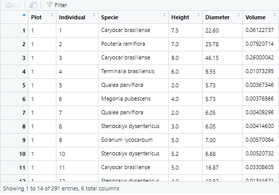

 "active": {
    "description": "The project has reached a stable, usable state and is being actively developed.", 
    "display_name": "Active", 
    "url": "https://www.repostatus.org/badges/latest/active.svg"
  }

# forestry
> A Simple R Package for Forest Inventory.

## Table of contents
* [General info](#general-info)
* [Setup](#setup)
* [Code Examples](#code-examples)
* [Status](#status)
* [References](#references)
* [Contact](#contact)

## General info 
The 'forestry' package emerged with the need to speed up the calculation of volumetric parameters for forest inventories, as well as phytosociological parameters, returning the main results in a docx file, using the 'officer' package. For now, the available samples are Simple Casual Sampling, Stratified Casual Sampling, Two Stage Sampling and the Bitterlich method.

## Setup
#To install:

`install.packages("devtools")`

`library(devtools)`

`install_github("igorcobelo/forestry")`

`library(forestry)`

## Code Examples
#Before starting, check the current directory:

`getwd()`

#Calculate the Simple Casual Sampling parameters for a required error of 10 percent and a significance level of 5 percent, for a total area of 27 hectares and plots of 0.1 hectares.

#'x' must be a data frame with six columns: plots in the first (in numerals), numbering of individuals in the second (in numerals), species in the third, height in the fourth (in meters), diameter in the fifth (in centimeters) and volume in the sixth (in cubic meters):

#A docx file will be saved in your current directory after executing the function. For the English language, use the argument pt=F (T is for the Portuguese language).

`acs(x, A=27, a=0.1, E=0.1, p=0.05, pt=F)`

#If you want to generate a table with a volume of protected species, indicate them in the 'prot' argument:

`acs(x, A=27, a=0.1, E=0.1, p=0.05, pt=F, prot=c(Caryocar brasiliense, Myracrodruon urundeuva))`

#If rn=T, the sample intensity is recalculated again from the value of t based on the first result of the sample intensity. The 'ampl' argument indicates the range of classes for the diametric distribution graph.

#Output graphic of diametric distribution:

#Output graphic of Importance Value Index:

#See the documentation for the other functions:

`?ace`

`?twos`

`?bit`

## Status
The 'forestry' project is underway and aims to include other processes and methods of sampling in the package.
If you have suggestions for improvements, please contact us.

## References

Pellico Netto, S.; Brena, D. (1997). Inventario florestal. Curitiba: Universidade Federal do Parana, 316 p.

## Contact
Created by [@forestrypackage](https://www.instagram.com/forestrypackage/) - Contact us for the course 'Forest Inventory with R':
<cobelo.igor@gmail.com>

To cite 'forestry' in publications, please use:

Ferreira, Igor C. (2020). forestry: A Simple R Package for Forest Inventory. R package version 0.1.0. Brasilia, Brazil. http://github.com/igorcobelo/forestry
